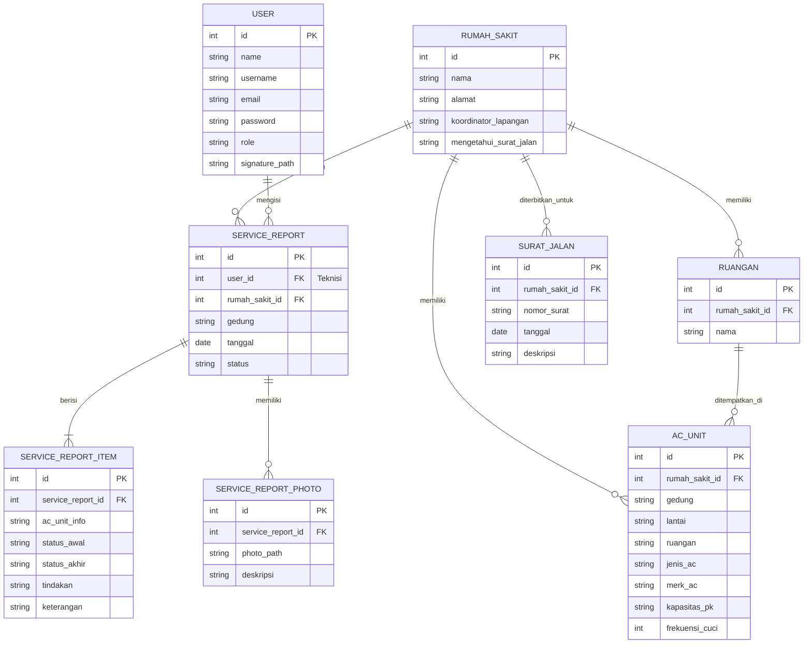

# 🛠️ AC Maintenance Management System

Sistem Manajemen Perawatan & Pemeliharaan AC (Air Conditioner) berbasis web yang dirancang khusus untuk mempermudah pemantauan, pelaporan, dan pengelolaan unit AC di berbagai rumah sakit secara real-time dan efisien.

---

## 🚀 Fitur Utama

Sistem ini memiliki dua peran utama dengan alur kerja yang terintegrasi:

### 1. Panel Administrator (Admin)
- **Dashboard Pemantauan**: Statistik cepat mengenai total unit AC, rumah sakit, ruangan, laporan pemeliharaan aktif, dan status terkini.
- **Manajemen Data Master (CRUD)**:
  - **Rumah Sakit & Koordinator**: Mengelola daftar rumah sakit beserta koordinator lapangan masing-masing.
  - **Ruangan**: Pengelolaan daftar ruangan spesifik per rumah sakit.
  - **Unit AC**: Pendataan unit AC lengkap dengan data teknis (merk, jenis, kapasitas PK, lantai, dan frekuensi cuci rutin).
  - **Teknisi**: Mengelola data akun teknisi beserta tanda tangan digital mereka.
- **Pengelolaan Surat Jalan**: Membuat dan mencetak Surat Jalan resmi dalam format PDF untuk kunjungan teknisi.
- **Monitoring Laporan (Service Reports)**: Melihat hasil perawatan dari teknisi, memverifikasi item checklist, melihat foto bukti kerja, dan ekspor ke format PDF.
- **Sistem Cadangan (Backup Data)**: Melakukan backup data database secara instan untuk keamanan berkala.

### 2. Portal Teknisi (Technician Workspace)
- **Pelaporan Perawatan Digital**: Teknisi dapat mengisi form laporan perawatan AC secara real-time langsung melalui smartphone/tablet di lapangan.
- **Checklist Perawatan**: Checklist digital yang mencakup pengecekan unit, cuci indoor/outdoor, dan status operasional.
- **Unggah Foto Bukti**: Mendukung unggahan foto sebelum dan sesudah pengerjaan sebagai bukti otentik.
- **Akses Cepat Surat Jalan**: Melihat daftar tugas aktif yang ditugaskan oleh admin.

---

## 🛠️ Tech Stack & Dependensi

Proyek ini dibangun di atas fondasi teknologi modern:

- **Framework Core**: [Laravel 12.x](https://laravel.com) (PHP >= 8.2)
- **Frontend Compiler**: [Vite 7.x](https://vite.dev)
- **Styling**: [TailwindCSS v4.0](https://tailwindcss.com) (Menggunakan integrasi `@tailwindcss/vite` yang super cepat)
- **PDF Generator**: [Barryvdh Laravel DomPDF](https://github.com/barryvdh/laravel-dompdf) untuk ekspor laporan dan surat jalan.
- **Database**: SQLite (Default) / MySQL

---

## 📊 Hubungan Database (Database Schema)

Berikut adalah diagram relasi antarentitas dalam aplikasi AC Maintenance:



---

## 🔑 Kredensial Akun Default (Seeder)

Anda dapat langsung masuk ke sistem menggunakan akun uji coba berikut setelah menjalankan database seeder:

| Peran (Role) | Username | Password | Deskripsi |
| :--- | :--- | :--- | :--- |
| **Administrator** | `admin` | `password` | Akses penuh ke data master, laporan, surat jalan, dan backup. |
| **Teknisi 1** | `choirudin` | `123` | Mengisi laporan perawatan & melihat surat jalan aktif. |
| **Teknisi 2** | `inas` | `123` | Mengisi laporan perawatan & melihat surat jalan aktif. |

*Data Rumah Sakit awal (**RS Ubaya**, **RS Haji**, dan **RS Mata**) beserta ratusan unit AC bawaan otomatis terbuat melalui seeder `database/seeders/RsMataSeeder.php`.*

---

## ⚙️ Petunjuk Pemasangan (Local Installation Guide)

Ikuti langkah-langkah di bawah ini untuk menjalankan proyek di lingkungan lokal Anda:

### 1. Klon Repositori & Masuk ke Direktori
```bash
git clone <repository-url>
cd maintenance_ac
```

### 2. Jalankan Perintah Setup Otomatis
Kami telah menyediakan skrip setup terintegrasi di `composer.json` untuk mempermudah pemasangan:
```bash
composer run setup
```
> [!NOTE]  
> Skrip `setup` di atas akan otomatis melakukan hal berikut:
> 1. Menginstal semua dependensi PHP melalui Composer.
> 2. Menduplikasi `.env.example` menjadi `.env`.
> 3. Membuat kunci enkripsi aplikasi (`key:generate`).
> 4. Menjalankan migrasi database (`migrate --force`).
> 5. Menginstal semua modul Node.js.
> 6. Membangun aset frontend production awal (`vite build`).

### 3. Konfigurasi Lingkungan (.env)
Sesuaikan pengaturan koneksi database Anda di file `.env`. Secara default, aplikasi menggunakan database SQLite atau MySQL. Jika ingin menggunakan SQLite:
```env
DB_CONNECTION=sqlite
# DB_DATABASE=/path/to/your/database.sqlite (bisa dikosongkan jika menggunakan default database/database.sqlite)
```

### 4. Isi Database dengan Data Awal (Seeder)
Jalankan seeder untuk mengisi akun admin, teknisi, data rumah sakit, dan ratusan data AC bawaan:
```bash
php artisan db:seed
```

### 5. Jalankan Lingkungan Pengembangan (Development Server)
Jalankan server Laravel dan compiler Vite secara bersamaan menggunakan skrip pintasan kami:
```bash
composer run dev
```
> [!TIP]  
> Perintah `composer run dev` menggunakan `concurrently` untuk menyalakan:
> - Server lokal Laravel (`php artisan serve`)
> - Antrean background listener (`php artisan queue:listen`)
> - Compiler aset real-time (`npm run dev` Vite server)
> - Pail logging (`php artisan pail`)

## 📱 API Produksi (Production API)

Website ini sudah terhosting di https://intankemilau.com/.

Untuk integrasi Flutter, gunakan Base URL produksi: `https://intankemilau.com/api`.

Contoh konfigurasi di Flutter:

```dart
class ApiConfig {
  static const String baseUrl = 'https://intankemilau.com/api';
}
```

Gunakan Base URL produksi tersebut untuk APK yang ingin sinkron dengan website live. Alamat lokal seperti `127.0.0.1`, `10.0.2.2`, atau IP laptop hanya dipakai kalau backend Laravel sedang dites di komputer lokal.

---

## 📂 Struktur Direktori Utama

Berikut adalah direktori-direktori penting untuk dipahami ketika melakukan pengembangan:

```text
├── app/
│   ├── Http/
│   │   └── Controllers/
│   │       ├── AdminController.php    # Mengatur alur logika Admin, Master Data & Laporan PDF
│   │       ├── AuthController.php     # Mengatur proses autentikasi (Login & Logout)
│   │       └── TeknisiController.php  # Mengatur form pelaporan perawatan di lapangan
│   └── Models/                        # Berisi Model Eloquent (User, RumahSakit, Ruangan, AcUnit, dll.)
├── database/
│   ├── migrations/                    # Struktur tabel database relasional
│   └── seeders/                       # Data awal untuk rumah sakit, unit AC, dan kredensial user
├── public/                            # Direktori publik (aset statis, file terupload)
├── resources/
│   ├── css/                           # Pengaturan custom styling Tailwind
│   └── views/                         # File visual antarmuka (.blade.php)
├── routes/
│   └── web.php                        # Seluruh rute (routing) navigasi aplikasi
└── vite.config.js                     # Konfigurasi integrasi Vite + Tailwind CSS v4
```

---

## 📄 Lisensi

Sistem ini dilisensikan di bawah [Lisensi MIT](LICENSE).
